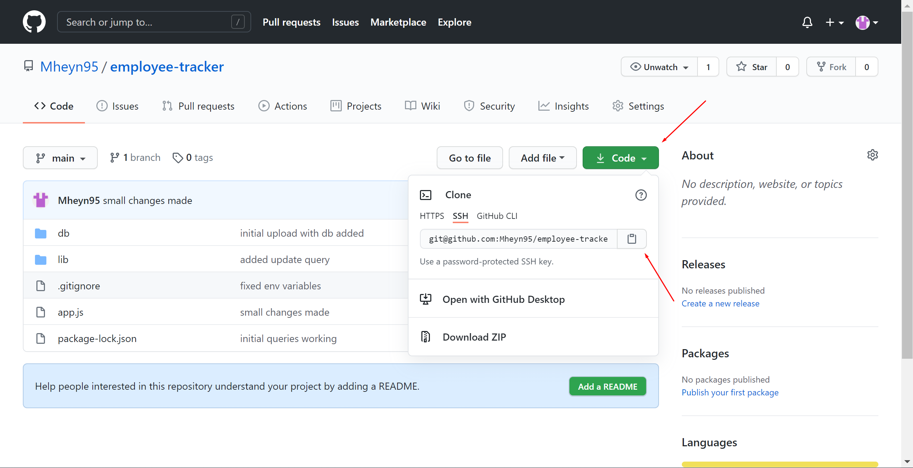
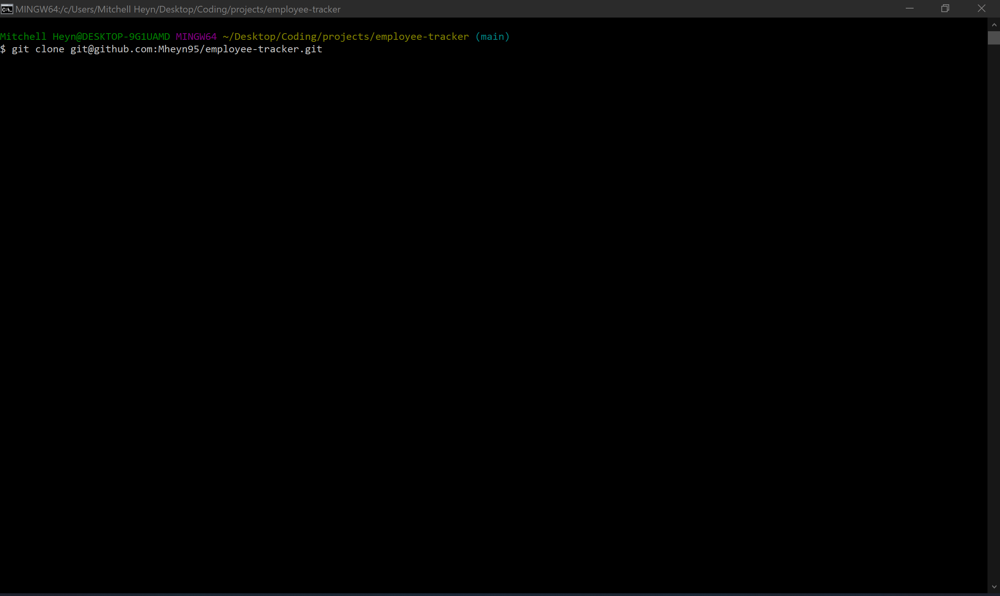
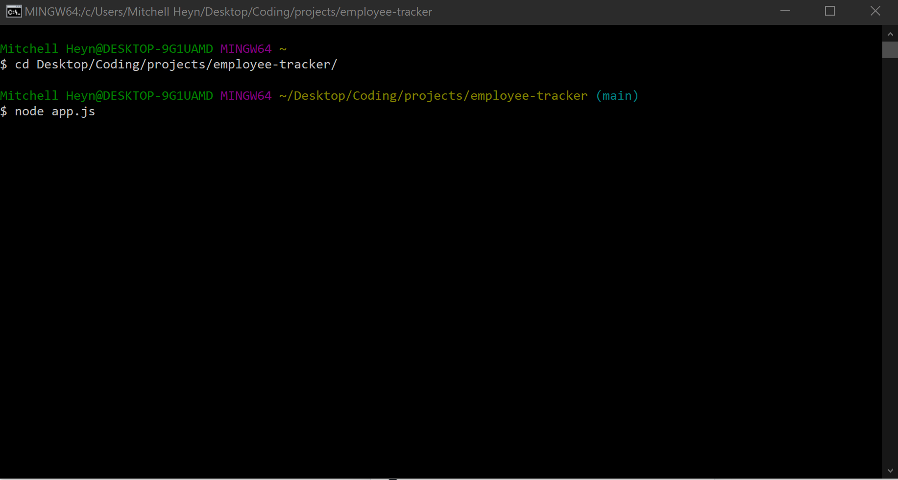

# Employee Tracker

## License

## Description

This application can be used to generate a database of employees and data that goes with them.

## Table of Contents

- [Installation](#installation)
- [Usage](#usage)
- [Questions](#questions)
- [License](#license)
- [Credits](#credits)

## Installation

To install this file navigate to [https://github.com/Mheyn95/employee-tracker](https://github.com/Mheyn95/readme-tracker) in a web browser and clone the repository.

Here is an image of GitHub and where you can go to clone the repo.

Here is an image of the command you run in terminal to clone the repo onto your own local machine

## Usage

To use this application go to the directory where you cloned the repository. Once here you can run "node app.js", the application will then run and prompt you for information.

Here you can see the different commands to run to navigate into the parent directory, and then in to the "Develop" directory. Once in there you can run the application by typing "node index.js"!

To watch a video of this application being used follow this link:
[README Generator Video](https://drive.google.com/file/d/1kkzN_19Ofx_6qMnRPI-Tou6m80aqZVgY/view)

## Questions

- GitHub - [https://github.com/Mheyn95](https://github.com/Mheyn95)
- Email - [mheyn95@gmail.com](mailto:mheyn95@gmail.com)

## Contributing

Mitchell Heyn
